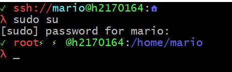
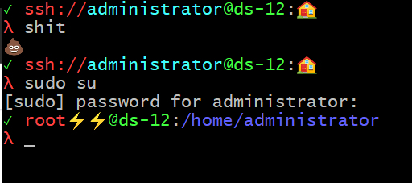
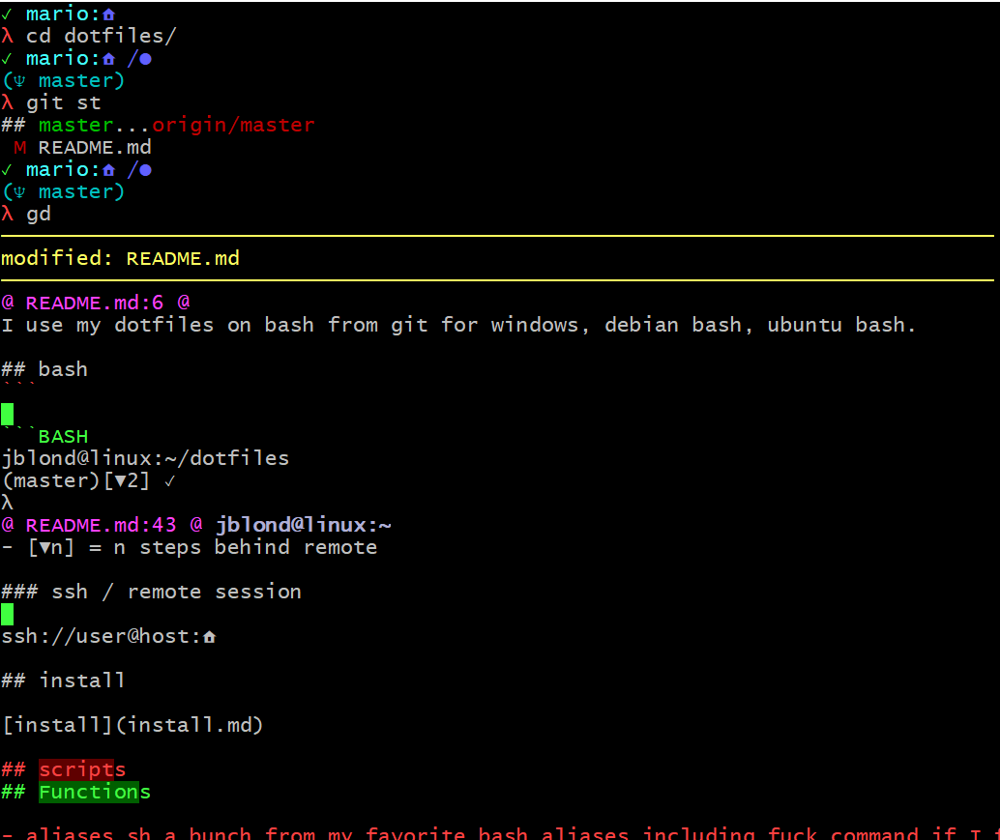
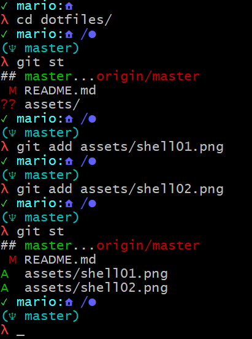
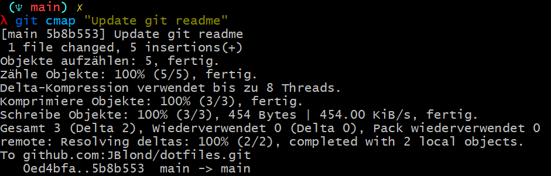
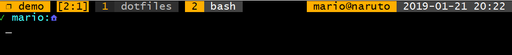
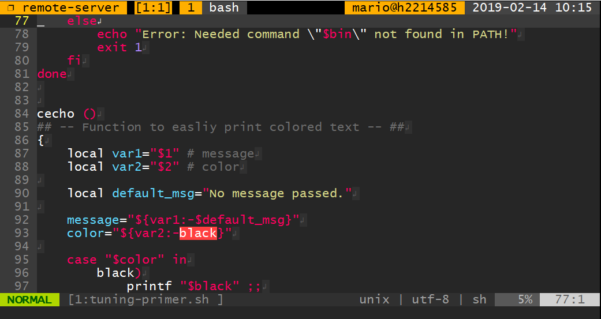
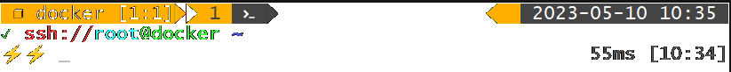
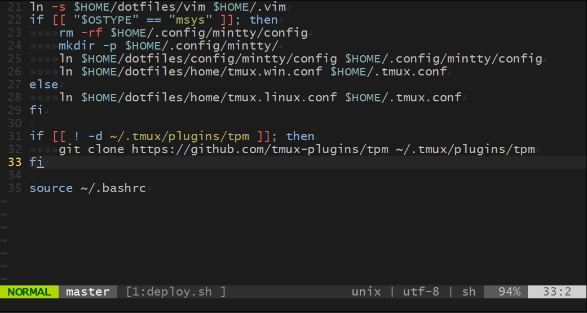
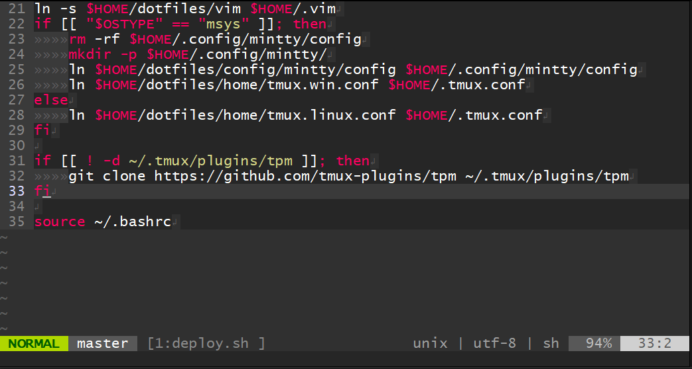

# dotfiles



I use my dotfiles on bash and fish shell from git for windows, debian bash and fish , ubuntu bash and fish. Works on OSX bash, too.

Using tmux on git for windows download the [Git for Windows SDK](https://github.com/git-for-windows/build-extra/releases/latest)
and run pacman.

```bash
pacman -S tmux fish make
```

## emojis in mintty

### Download 

[Download emojis](https://github.com/JBlond/emojis/archive/refs/tags/1.0.0.zip)

### make the emojis yourself

in C:\Program Files\Git\usr\share\mintty\emojis or C:\git-sdk-64\usr\share\mintty\emojis download

```bash
mkdir emojis
cd emojis
curl -LO https://raw.githubusercontent.com/wiki/mintty/mintty/getemojis
./getemojis -d
./getemojis .
```

Mintty -> Options -> Text -> Emojis -> Style -> google

Mintty -> Options -> Text -> Emojis -> Placement -> middle

### mintty with emoji



## install & update

```bash
git clone -c core.autocrlf=false https://github.com/JBlond/dotfiles.git
cd dotfiles
make update
```

### use make

[make options](install.md)

## bash

**[bash functions README](bash.md)**

```BASH
jblond@linux:~/dotfiles
(main)[▼2] ✓
λ
jblond@linux:~/dotfiles
(main)[▼2] ✓
λ git pull
jblond@linux:~/dotfiles
(main) ✓
jblond@linux:~/dotfiles
(main) 1⬤ 4Ξ 1✗ 1⚡⚡
λ git commit -a -m "my commit"
jblond@linux:~/dotfiles
(main)[▲1] ✓
λ git push
jblond@linux:~/dotfiles
(main) ✓
λ
jblond@linux:~/dotfiles
(main) ✓
λ ..
jblond@linux:~
λ

```

- ✓ = repo is clean
- n⚡⚡  = n untracked files
- nΞ = n added files
- n⬤ = n modified files
- nᏪ = n renamed files
- n✗ = n deleted files
- [▲n] = n steps ahead of remote
- [▼n] = n steps behind remote

## git aliases and commands

**[git README](git.md)**

**[git aliases](git/aliases.ini#L2-L53)**







## ssh / remote session

ssh://user@host:🏠

## fast fish prompt

```bash
time fish_prompt                                              13ms []15:55
✓ root@host ~
λ
________________________________________________________
Executed in   13,11 millis    fish           external
   usr time    7,80 millis    1,37 millis    6,43 millis
   sys time    5,08 millis    4,12 millis    0,96 millis

✓ root@host ~
λ
```

## Functions

- [fish functions](fish.md)
- [goto](https://github.com/iridakos/goto)
- bash completion
- ssh completion  ssh example <kbd>TAB</kbd> reads the ~/.ssh/config file for host completion
- [diff-so-fancy](https://github.com/so-fancy/diff-so-fancy) fancy diff for git ( and others)
- [docker aliases + ssh into docker / docker exec completion](bashrc/04_docker.sh). e.g. dssh example <kbd>TAB</kbd>
- git_functionspart for simplify git.  an = add next git file dn = diff next file
- git-prompt have a nice prompt inside git repos
- [git alias](git.md)

## Tmux

**[tmux README](tmux.md)** custom shortcuts and other good stuff




### Powerline theme



Activate with <kbd>CTRL</kbd> + <kbd>B</kbd> <kbd>+</kbd> 

See also [tmux README](tmux.md)

The [power line font](https://github.com/JBlond/dotfiles/raw/main/ttf/Lucida_Console_for_Powerline.ttf) is included in the repo.

## Vim

Vim has different Syntax highlighting themes. Can be changed using <kbd>CTRL</kbd> + <kbd>Y</kbd>

### hybrid reverse



### monokai



## mysql prompt

This changes also the mysql prompt. You will know where you and what DB you are using.

```bash
mysql -hlocalhost -ujblond -p
Enter password:
Welcome to the MariaDB monitor.  Commands end with ; or \g.
Your MariaDB connection id is 3295
Server version: 10.3.29-MariaDB-0+deb10u1 Debian 10

Copyright (c) 2000, 2018, Oracle, MariaDB Corporation Ab and others.

Type 'help;' or '\h' for help. Type '\c' to clear the current input statement.

(jblond@example.com:(none))> use mysql;
Reading table information for completion of table and column names
You can turn off this feature to get a quicker startup with -A

Database changed
(jblond@example.com:mysql)> quit;
Bye
```
