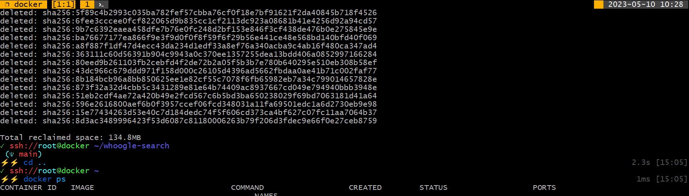

# tmux

With this tmux config you can use nested sessions.

## Powerline Theme

Load the powerline theme, if you have a font installed that supports it.

<kbd>CTRL</kbd> + <kbd>B</kbd> <kbd>+</kbd>

## keys

| tmux key  | Description |
| ------------- | ------------- |
| <kbd>F1</kbd> | new window |
| <kbd>F2</kbd> | next window |
| <kbd>F3</kbd> | previous window |
| <kbd>F4</kbd> | Close window and its panes. The last window closes tmux, too. |
| <kbd>F5</kbd> | Reload config |
| <kbd>F6</kbd> | Toogle status bar on and off |
| <kbd>F7</kbd> | New Session |
| <kbd>F8</kbd> | detach |
| <kbd>F9</kbd> | Rotate through different pre set layouts |
| <kbd>F11</kbd> | Toogle mouse on and off |
| <kbd>F12</kbd> | Turn off/on the parent **tmux in nested tmux** or for the use of a program like midnight commander (mc) that uses the F keys itself |
| <kbd>CTRL</kbd> + <kbd>B</kbd> <kbd>\|</kbd> | Split window vertical |
| <kbd>CTRL</kbd> + <kbd>B</kbd> <kbd>-</kbd> | Split window horizontal |
| <kbd>CTRL</kbd> + <kbd>B</kbd> <kbd>S</kbd> | Toggle pane synchronization |
| <kbd>CTRL</kbd> + <kbd>B</kbd> <kbd>!</kbd> | Pane to window |
| <kbd>CTRL</kbd> + <kbd>B</kbd> <kbd>Spacebar</kbd> | Toggle between pane layouts |
| <kbd>CTRL</kbd> + <kbd>B</kbd> <kbd>r</kbd> | Reload config |
| <kbd>CTRL</kbd> + <kbd>B</kbd> <kbd>$</kbd> | Rename session |
| <kbd>CTRL</kbd> + <kbd>B</kbd> <kbd>,</kbd> | Rename window |
| <kbd>CTRL</kbd> + <kbd>B</kbd> <kbd>z</kbd> | Zoom into pane or window / zoom out |
| <kbd>CTRL</kbd> + <kbd>B</kbd> <kbd>PageUp</kbd> or <kbd>PageDown</kbd> | Scrolling |
| <kbd>CTRL</kbd> + <kbd>B</kbd> <kbd>w</kbd> | List sessions and windows |
| <kbd>CTRL</kbd> + <kbd>B</kbd> <kbd>s</kbd> | List sessions |
| <kbd>CTRL</kbd> + <kbd>B</kbd> <kbd>d</kbd> | Detach from session |
| <kbd>CTRL</kbd> + <kbd>B</kbd> <kbd>&</kbd> | Close current window |
| <kbd>CTRL</kbd> + <kbd>B</kbd> <kbd>q</kbd> | Number all windows and panes |
| <kbd>CTRL</kbd> + <kbd>B</kbd> <kbd>Crtl</kbd> + <kbd>v</kbd> | paste |
| <kbd>Alt</kbd> + <kbd>0</kbd>-<kbd>9</kbd> | Switch to workspace number 0-9 |

### Switch panes using Alt-arrow without prefix

- <kbd>ALT</kbd> + <kbd>➡️</kbd> <kbd>⬇️</kbd> <kbd>⬅️</kbd> <kbd>⬆️</kbd>

### Moving Windows

- <kbd>SHITFT</kbd> + <kbd>➡️</kbd> <kbd>⬅️</kbd>

## Sharing Terminal Sessions Between Two Different Accounts

In the first terminal, start tmux where shared is the session name and shareds is the name of the socket:

`tmux -S /tmp/shareds new -s shared`

In the second terminal attach using that socket and session.

`tmux -S /tmp/shareds attach -t shared`

The decision to work read-only is made when the second user attaches to the session.

`tmux -S /tmp/shareds attach -t shared -r`

## Split in three equal panes

<kbd>CTRL</kbd> + <kbd>B</kbd> <kbd>|</kbd>
<kbd>CTRL</kbd> + <kbd>B</kbd> <kbd>|</kbd>
<kbd>CTRL</kbd> + <kbd>B</kbd> <kbd>:</kbd> `select-layout even-horizontal`

### or

<kbd>CTRL</kbd> + <kbd>B</kbd> <kbd>-</kbd>
<kbd>CTRL</kbd> + <kbd>B</kbd> <kbd>-</kbd>
<kbd>CTRL</kbd> + <kbd>B</kbd> <kbd>:</kbd> `select-layout even-vertical`

<kbd>CTRL</kbd> + <kbd>B</kbd> <kbd>:</kbd> `tmux select-layout tiled`
